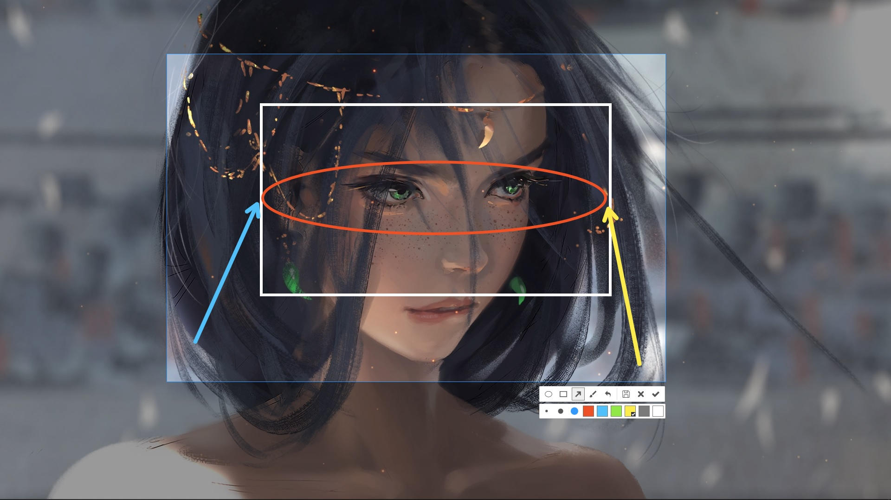
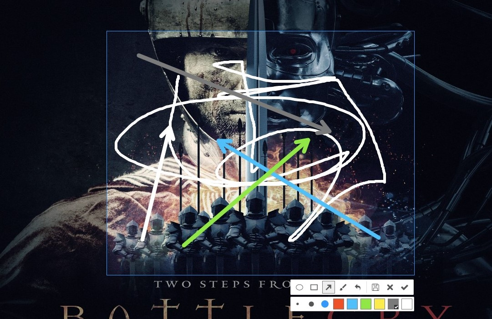

# screenshots

electron 截图插件和 react 截图界面插件

## 开发

```bash
git clone https://github.com/nashaofu/screenshots.git
cd screenshots

yarn && yarn build

cd packages/electron-screenshots

# 监听文件改变，源码文件变动后自动编译
yarn dev

# 在新终端执行如下命令，启动截图窗口，按下ctrl+shift+a截图
# 如果是在vscode,则可在vscode中打开文件夹packages/electron-screenshots，然后按F5进入调试，可在src文件夹下的文件中打断点
yarn start
```

## electron-screenshots

electron 截图插件，[electron-screenshots 文档](./packages/electron-screenshots/README.md)

### Install

[](https://nodei.co/npm/electron-screenshots/)

### Screenshot



## react-screenshots

react 截图界面插件与`electron-screenshots`渲染 进程界面，[react-screenshots 文档](./packages/react-screenshots/README.md)

### Install

[](https://nodei.co/npm/react-screenshots/)

### Screenshot


