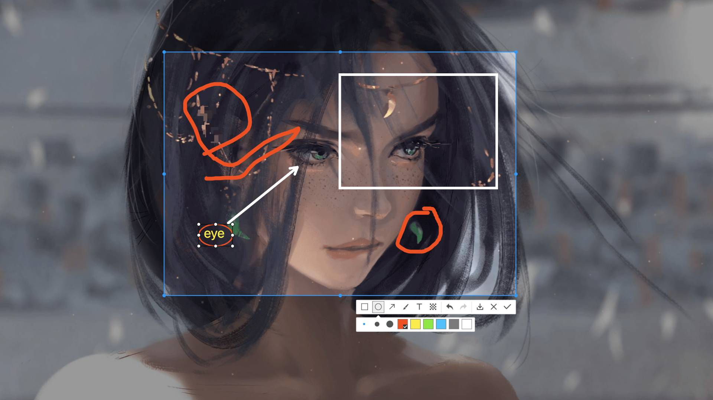

# screenshots

electron 截图插件和 react 截图界面插件

## Features

- 双击页面完成截图，触发`ok`事件
- 右键点击取消截图，触发`cancel`事件
- 多语言支持
- 截图操作：马赛克、文本、画笔、箭头、椭圆、矩形

## electron-screenshots

electron 截图插件，[electron-screenshots 文档](./packages/electron-screenshots/README.md)

### Install

## react-screenshots

react 截图界面插件与`electron-screenshots`渲染 进程界面，[react-screenshots 文档](./packages/react-screenshots/README.md)

### Install

