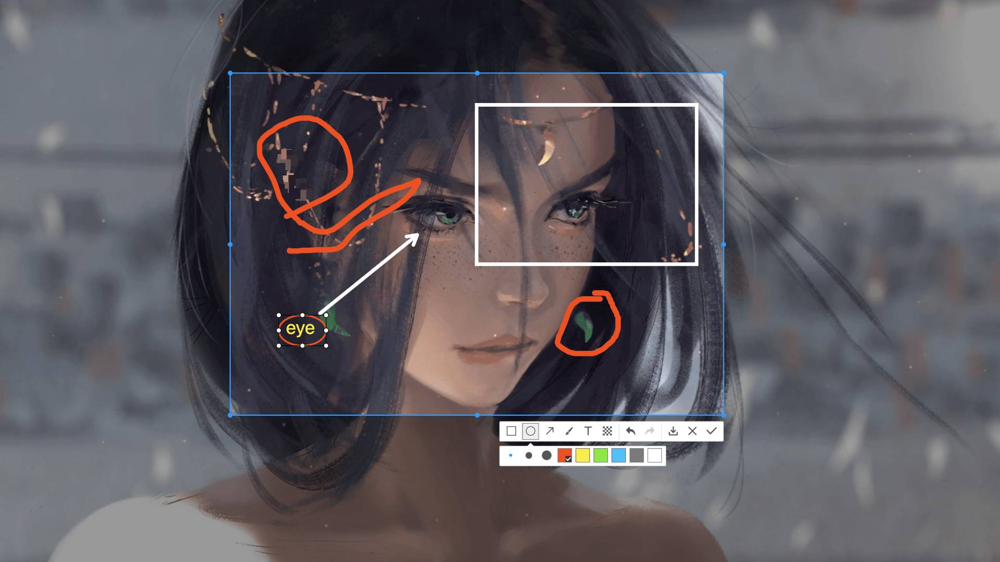

# electron-screenshots

> electron 截图插件

## Prerequisites

- electron >= 11

## Install

[](https://nodei.co/npm/electron-screenshots/)

## Usage

```ts
import debug from 'electron-debug'
import { app, globalShortcut } from 'electron'
import Screenshots from './screenshots'

app.whenReady().then(() => {
  const screenshots = new Screenshots()
  globalShortcut.register('ctrl+shift+a', () => {
    screenshots.startCapture()
    screenshots.$view.webContents.openDevTools()
  })
  // 点击确定按钮回调事件
  screenshots.on('ok', (e, buffer, bounds) => {
    console.log('capture', buffer, bounds)
  })
  // 点击取消按钮回调事件
  screenshots.on('cancel', () => {
    console.log('capture', 'cancel1')
  })
  screenshots.on('cancel', e => {
    // 执行了preventDefault
    // 点击取消不会关闭截图窗口
    e.preventDefault()
    console.log('capture', 'cancel2')
  })
  // 点击保存按钮回调事件
  screenshots.on('save', (e, buffer, bounds) => {
    console.log('capture', buffer, bounds)
  })
  debug({ showDevTools: true, devToolsMode: 'undocked' })
})

app.on('window-all-closed', () => {
  if (process.platform !== 'darwin') {
    app.quit()
  }
})
```

### 注意

- 如果使用了 webpack 打包主进程，请在主进程 webpack 配置中修改如下配置，否则可能会出现不能调用截图窗口的情况

```js
{
  externals: {
    'electron-screenshots': 'require("electron-screenshots")'
  }
}
```

- `vue-cli-plugin-electron-builder`配置示例[vue-cli-plugin-electron-builder-issue](https://github.com/nashaofu/vue-cli-plugin-electron-builder-issue/blob/0f774a90b09e10b02f86fcb6b50645058fe1a4e8/vue.config.js#L1-L8)

```js
// vue.config.js
module.exports = {
  publicPath: '.',
  pluginOptions: {
    electronBuilder: {
      // 不打包，使用 require 加载
      externals: ['electron-screenshots']
    }
  }
}
```

- esc 取消截图，可用以下代码实现按 esc 取消截图

```js
globalShortcut.register('esc', () => {
  if (screenshots.$win?.isFocused()) {
    screenshots.endCapture()
  }
})
```

- 加速截图界面展示，不销毁`BrowserWindow`，减少创建窗口的开销，可用以下代码实现。**需注意，启用该功能，会导致`window-all-closed`事件不触发，因此需要手动关闭截图窗口**

```js
// 是否复用截图窗口，加快截图窗口显示，默认值为 false
// 如果设置为 true 则会在第一次调用截图窗口时创建，后续调用时直接使用
// 且由于窗口不会 close，所以不会触发 app 的 `window-all-closed` 事件
const screenshots = new Screenshots({
  singleWindow: true
})
```

## Methods

- `Debugger`类型产考`debug`中的`Debugger`类型

```ts
export type LoggerFn = (...args: unknown[]) => void
export type Logger = Debugger | LoggerFn

export interface Lang {
  magnifier_position_label?: string
  operation_ok_title?: string
  operation_cancel_title?: string
  operation_save_title?: string
  operation_redo_title?: string
  operation_undo_title?: string
  operation_mosaic_title?: string
  operation_text_title?: string
  operation_brush_title?: string
  operation_arrow_title?: string
  operation_ellipse_title?: string
  operation_rectangle_title?: string
}

export interface ScreenshotsOpts {
  lang?: Lang
  // 调用日志，默认值为 debug('electron-screenshots')
  // debug https://www.npmjs.com/package/debug
  logger?: Logger
  // 是否复用截图窗口，加快截图窗口显示，默认值为 false
  // 如果设置为 true 则会在第一次调用截图窗口时创建，后续调用时直接使用
  // 且由于窗口不会 close，所以不会触发 app 的 `window-all-closed` 事件
  singleWindow?: boolean
}
```

| 名称                                              | 说明             | 返回值 |
| ------------------------------------------------- | ---------------- | ------ |
| `constructor(opts: ScreenshotsOpts): Screenshots` | 调用截图方法截图 | -      |
| `startCapture(): Promise<void>`                   | 调用截图方法截图 | -      |
| `endCapture(): Promise<void>`                     | 手动结束截图     | -      |
| `setLang(lang: Lang): Promise<void>`              | 修改语言         | -      |

## Events

- 数据类型

```ts
interface Bounds {
  x: number
  y: number
  width: number
  height: number
}

export interface Display {
  id: number
  x: number
  y: number
  width: number
  height: number
}

export interface ScreenshotsData {
  bounds: Bounds
  display: Display
}

class Event {
  public defaultPrevented = false

  public preventDefault(): void {
    this.defaultPrevented = true
  }
}
```

| 名称   | 说明         | 回调参数                                                        |
| ------ | ------------ | --------------------------------------------------------------- |
| ok     | 截图确认事件 | `(event: Event, buffer: Buffer, data: ScreenshotsData) => void` |
| cancel | 截图取消事件 | `(event: Event) => void`                                        |
| save   | 截图保存事件 | `(event: Event, buffer: Buffer, data: ScreenshotsData) => void` |

### 说明

- event: 事件对象
- buffer: png 图片 buffer
- bounds: 截图区域信息
- display: 截图的屏幕
- `event`对象可调用`preventDefault`方法来阻止默认事件，例如阻止默认保存事件

```ts
const screenshots = new Screenshots({
  lang: {
    magnifier_position_label: 'Position',
    operation_ok_title: 'Ok',
    operation_cancel_title: 'Cancel',
    operation_save_title: 'Save',
    operation_redo_title: 'Redo',
    operation_undo_title: 'Undo',
    operation_mosaic_title: 'Mosaic',
    operation_text_title: 'Text',
    operation_brush_title: 'Brush',
    operation_arrow_title: 'Arrow',
    operation_ellipse_title: 'Ellipse',
    operation_rectangle_title: 'Rectangle'
  }
})

screenshots.on('save', (e, buffer, data) => {
  // 阻止插件自带的保存功能
  // 用户自己控制保存功能
  e.preventDefault()
  // 用户可在这里自己定义保存功能
  console.log('capture', buffer, data)
})

screenshots.startCapture()
```

## Screenshot


